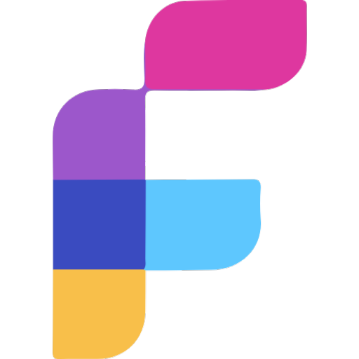

<!-- PROJECT SHIELDS -->
[![Forks][forks-shield]][forks-url]
[![Stargazers][stars-shield]][stars-url]
[![Issues][issues-shield]][issues-url]
[![MIT License][license-shield]][license-url]

<!-- PROJECT LOGO -->
 

  

<h3 align="center">Frpc-Desktop</h3>

  

    🎉 一个Frp Client 跨平台桌面端
     
  

## 演示

[//]: # (## 里程碑)

[//]: # (- 2023-11-28: 发布v1.0版本)

## License

[MIT](LICENSE)

<!-- MARKDOWN LINKS & IMAGES -->
[forks-shield]: https://img.shields.io/github/forks/luckjiawei/frpc-desktop.svg?style=for-the-badge
[forks-url]: https://github.com/luckjiawei/frpc-desktop/network/members
[stars-shield]: https://img.shields.io/github/stars/luckjiawei/frpc-desktop.svg?style=for-the-badge
[stars-url]: https://github.com/luckjiawei/frpc-desktop/stargazers
[issues-shield]: https://img.shields.io/github/issues/luckjiawei/frpc-desktop.svg?style=for-the-badge
[issues-url]: https://github.com/luckjiawei/frpc-desktop/issues
[license-shield]: https://img.shields.io/github/license/luckjiawei/frpc-desktop.svg?style=for-the-badge
[license-url]: https://github.com/luckjiawei/frpc-desktop/blob/master/LICENSE.txt
