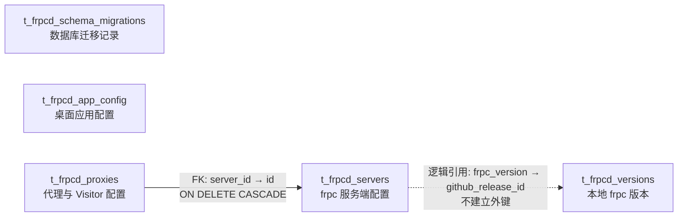

# SQLite 数据库设计

## 1. 文档目的

本文档描述 Frpc-Desktop 从 NeDB 迁移到 SQLite 后的数据库设计。设计以当前代码中的 `OpenSourceFrpcDesktopServer`、`FrpcProxy` 和 `FrpcVersion` 三类持久化对象为基准，目标是在不改变现有业务行为和 IPC 数据结构的前提下：

- 将 3 个独立 NeDB 文件合并为 1 个 SQLite 数据库；
- 将桌面应用设置从 server 配置中拆分到独立的应用配置表；
- 保留现有 `_id`、字段含义和默认值，兼容已有用户数据；
- 为布尔值、状态、唯一标识等字段增加明确约束；
- 支持事务、数据库版本管理以及失败后安全回滚；
- 为未来多服务端配置预留扩展空间，但本次迁移仍保持单服务端行为。

本文档只定义目标结构与迁移原则，不包含具体 SQLite 驱动选型和实现代码。

## 2. 当前持久化结构

当前数据库目录为 Electron `app.getPath("userData")/db`，由 `BaseRepository` 创建以下文件：

| NeDB 文件 | 持久化对象 | 主键与访问特征 |
| --- | --- | --- |
| `server-v2.db` | `OpenSourceFrpcDesktopServer` | 固定 `_id = "1"`，实际为单例配置 |
| `proxy-v2.db` | `FrpcProxy` | UUID 主键，支持新增、全量查询、整体更新、状态更新和删除 |
| `version-v2.db` | `FrpcVersion` | UUID 主键，通过 `githubReleaseId` 查询和判断是否存在 |

NeDB 中的嵌套对象和数组直接以 JSON 保存。当前没有数据库级外键、唯一索引、字段非空约束或显式 schema 版本。

### 2.1 当前实体关系

```text
server（固定 id = "1"）
  ├── frpcVersion ──逻辑引用──> version.githubReleaseId
  └── 隐式拥有 ───────────────> proxy（全部代理）
```

`frpcVersion` 仅是逻辑引用。当前业务允许删除某个已下载版本，因此目标数据库不为该字段添加外键，避免改变既有删除行为。

## 3. SQLite 总体约定

### 3.1 数据库文件

- 文件名：`frpc-desktop.sqlite3`
- 路径：`app.getPath("userData")/db/frpc-desktop.sqlite3`
- 一个应用实例只使用一个数据库连接管理组件；Repository 不应各自创建独立数据库文件。
- 不手工修改数据库文件、`-wal` 文件或 `-shm` 文件。

### 3.2 连接参数

每个连接建立后执行：

```sql
PRAGMA foreign_keys = ON;
PRAGMA journal_mode = WAL;
PRAGMA synchronous = NORMAL;
PRAGMA busy_timeout = 5000;
```

说明：

- `foreign_keys` 必须按连接开启；
- WAL 提升异常退出后的恢复能力，并减少读写互相阻塞；
- 当前 Electron 主进程是唯一数据库写入方，不允许 renderer 直接访问数据库；
- 数据库关闭或备份时，需要同时正确处理 WAL checkpoint。

### 3.3 命名和类型

- 表名和列名使用 `snake_case`；
- TypeScript `_id` 映射到数据库 `id TEXT PRIMARY KEY`，Repository 返回对象时再映射回 `_id`；
- JavaScript `boolean` 映射为 `INTEGER NOT NULL CHECK (value IN (0, 1))`；
- 端口映射字段使用 `INTEGER`，但代理的 `local_port`、`remote_port` 保持 `TEXT`，因为现有功能支持单端口、逗号列表和端口范围；
- TypeScript 中本身包含多个子属性的配置对象、数组和动态对象使用 JSON 文本，并通过 `CHECK (json_valid(...))` 与 `json_type(...)` 校验；
- 当前对象没有创建时间和更新时间字段，本次不凭空补写时间，避免生成无法还原的迁移数据。

## 4. 表结构

所有业务表和数据库管理表统一使用 `t_frpcd_` 前缀，避免与同一数据库中未来可能增加的其他模块表冲突。

### 4.1 数据关系图



- f实线表示数据库外键，删除 server 时级联删除其 proxy；
- 虚线表示业务层逻辑引用，不由 SQLite 强制约束；
- `t_frpcd_app_config` 的作用域是多态设计，当前没有 user、project 实体表，因此 `scope_id` 不建立外键；
- `t_frpcd_schema_migrations` 是独立的数据库管理表，不与业务表关联。

### 4.2 `t_frpcd_schema_migrations`

记录已执行的数据库迁移。应用启动时必须先执行未应用的迁移，再初始化 Repository 和业务服务。

| 字段 | 类型 | 约束 | 说明 |
| --- | --- | --- | --- |
| `version` | INTEGER | PRIMARY KEY | 单调递增的迁移版本 |
| `name` | TEXT | NOT NULL | 迁移名称 |
| `applied_at` | TEXT | NOT NULL | UTC ISO 8601 时间 |

### 4.3 `t_frpcd_app_config`

使用 Key-Value 模型保存 Frpc-Desktop 自身的桌面设置，与 frpc 服务端连接配置分离。一个配置项占一行，新增配置项时不需要修改表结构。

| 字段 | 类型 | 可空 | 默认值 | 说明 |
| --- | --- | --- | --- | --- |
| `id` | TEXT | 否 | — | 主键，UUID，由应用层生成 |
| `scope_type` | TEXT | 否 | `'global'` | 配置作用域：global-全局 |
| `scope_id` | TEXT | 是 | NULL | 作用域对象 ID；全局配置为空，用户或项目配置填写对应对象 ID |
| `namespace` | TEXT | 否 | — | 配置命名空间，用于区分功能模块 |
| `config_key` | TEXT | 否 | — | 配置键；与作用域、命名空间组成有效配置唯一约束 |
| `value_type` | TEXT | 否 | `'string'` | 值类型：string、integer、boolean、json |
| `config_value` | TEXT | 否 | — | 配置值；统一以文本存储，由应用层按 `value_type` 解析 |
| `is_secret` | INTEGER | 否 | 0 | 是否为敏感配置：1-是、0-否 |
| `encryption_type` | TEXT | 是 | NULL | 加密方式；非敏感配置必须为空，敏感配置可使用 aes-256-gcm |
| `version` | INTEGER | 否 | 1 | 配置版本号，用于乐观锁和配置变更控制 |
| `created_at` | TEXT | 否 | 当前 UTC 时间 | 创建时间，UTC ISO 8601 格式 |
| `updated_at` | TEXT | 否 | 当前 UTC 时间 | 最后更新时间，UTC ISO 8601 格式 |
| `deleted_at` | TEXT | 是 | NULL | 软删除时间，UTC ISO 8601 格式 |

作用域约束：

- `scope_type` 只允许 `global`、`user`、`project`；
- `global` 配置的 `scope_id` 必须为 NULL；
- `user`、`project` 配置的 `scope_id` 必须非空；
- 未软删除的配置在 `scope_type + COALESCE(scope_id, '') + namespace + config_key` 维度唯一；
- 查询配置时默认附加 `deleted_at IS NULL`，更新时使用 `version` 进行乐观锁校验。

当前桌面设置初始化为以下全局配置：

| namespace | config_key | value_type | config_value | 对应属性 |
| --- | --- | --- | --- | --- |
| `desktop` | `launch_at_startup` | `boolean` | `false` | `system.launchAtStartup` |
| `desktop` | `silent_startup` | `boolean` | `false` | `system.silentStartup` |
| `desktop` | `auto_connect_on_startup` | `boolean` | `false` | `system.autoConnectOnStartup` |
| `desktop` | `notify_updates` | `boolean` | `true` | `system.notifyUpdates` |
| `desktop` | `language` | `string` | `en-US` | `system.language` |

这些默认记录的 `id` 由应用层生成 UUID。当前 `OpenSourceFrpcDesktopServer.system` 仍保留为 service 和 IPC 层的兼容结构。读取 server 配置时，由 service 查询 `desktop` 命名空间并组装成现有 `system` 对象；保存配置时，在同一事务内分别更新 server 和对应配置项。renderer 不需要感知这一拆分。

`config_value` 的解析规则：

- `string`：直接返回文本；
- `integer`：应用层按十进制整数严格校验后转换，非法值不得写入；
- `boolean`：只允许小写文本 `true` 或 `false`；
- `json`：写入前执行序列化校验，读取后执行 JSON 解析；
- `is_secret = 1`：`config_value` 保存密文，应用层根据 `encryption_type` 解密后再按 `value_type` 解析。

### 4.4 `t_frpcd_servers`

保存 frpc 公共配置和服务端连接配置。桌面应用设置统一存放在 `t_frpcd_app_config`。当前版本只允许一条 `id = "1"` 的记录。

| 字段 | 类型 | 约束/默认值 | 对应属性 |
| --- | --- | --- | --- |
| `id` | TEXT | PRIMARY KEY；当前固定为 `"1"` | `_id` |
| `frpc_version` | INTEGER | NULL | `frpcVersion` |
| `multiuser` | INTEGER | NOT NULL DEFAULT 0；布尔检查 | `multiuser` |
| `user` | TEXT | NOT NULL DEFAULT `''` | `user` |
| `server_addr` | TEXT | NOT NULL DEFAULT `''` | `serverAddr` |
| `server_port` | INTEGER | NOT NULL DEFAULT 7000；1–65535 | `serverPort` |
| `login_fail_exit` | INTEGER | NOT NULL DEFAULT 0；布尔检查 | `loginFailExit` |
| `udp_packet_size` | INTEGER | NOT NULL DEFAULT 1500；大于 0 | `udpPacketSize` |
| `auth_json` | TEXT | NOT NULL；合法 JSON 对象 | `auth` 完整对象 |
| `log_json` | TEXT | NOT NULL；合法 JSON 对象 | `log` 完整对象 |
| `web_server_json` | TEXT | NOT NULL；合法 JSON 对象 | `webServer` 完整对象 |
| `transport_json` | TEXT | NOT NULL；合法 JSON 对象 | `transport` 完整对象，包含 `tls` 子对象 |
| `metadatas_json` | TEXT | NOT NULL DEFAULT `'{}'`；合法 JSON 对象 | `metadatas` |

`auth_json`、`web_server_json` 和 `transport_json` 中可能包含 token、密码、证书路径或代理地址，不得将完整 JSON 输出到普通日志或错误上报中。

### 4.5 `t_frpcd_proxies`

保存代理和 visitor 配置。为兼容当前模型，普通代理与 visitor 仍共用一张表，通过 `visitors_model` 区分。

| 字段 | 类型 | 约束/默认值 | 对应属性 |
| --- | --- | --- | --- |
| `id` | TEXT | PRIMARY KEY | `_id` |
| `server_id` | TEXT | NOT NULL DEFAULT `'1'`；外键 | 当前隐式所属 server |
| `name` | TEXT | NOT NULL DEFAULT `''` | `name` |
| `type` | TEXT | NOT NULL；限定 http/https/tcp/udp/stcp/xtcp/sudp | `type` |
| `local_ip` | TEXT | NOT NULL DEFAULT `''` | `localIP` |
| `local_port` | TEXT | NOT NULL DEFAULT `'8080'` | `localPort` |
| `remote_port` | TEXT | NOT NULL DEFAULT `'8080'` | `remotePort` |
| `custom_domains_json` | TEXT | NOT NULL DEFAULT `'[""]'`；合法 JSON 数组 | `customDomains` |
| `locations_json` | TEXT | NOT NULL DEFAULT `'[""]'`；合法 JSON 数组 | `locations` |
| `host_header_rewrite` | TEXT | NOT NULL DEFAULT `''` | `hostHeaderRewrite` |
| `visitors_model` | TEXT | NOT NULL DEFAULT `'visitors'` | `visitorsModel` |
| `server_user` | TEXT | NOT NULL DEFAULT `''` | `serverUser` |
| `server_name` | TEXT | NOT NULL DEFAULT `''` | `serverName` |
| `secret_key` | TEXT | NOT NULL DEFAULT `''` | `secretKey` |
| `bind_addr` | TEXT | NOT NULL DEFAULT `''` | `bindAddr` |
| `bind_port` | INTEGER | NULL；为空或 1–65535 | `bindPort` |
| `subdomain` | TEXT | NOT NULL DEFAULT `''` | `subdomain` |
| `basic_auth` | INTEGER | NOT NULL DEFAULT 0；布尔检查 | `basicAuth` |
| `http_user` | TEXT | NOT NULL DEFAULT `''` | `httpUser` |
| `http_password` | TEXT | NOT NULL DEFAULT `''` | `httpPassword` |
| `fallback_to` | TEXT | NOT NULL DEFAULT `''` | `fallbackTo` |
| `fallback_timeout_ms` | INTEGER | NOT NULL DEFAULT 500；大于等于 0 | `fallbackTimeoutMs` |
| `https2http` | INTEGER | NOT NULL DEFAULT 0；布尔检查 | `https2http` |
| `https2http_ca_file` | TEXT | NOT NULL DEFAULT `''` | `https2httpCaFile` |
| `https2http_key_file` | TEXT | NOT NULL DEFAULT `''` | `https2httpKeyFile` |
| `keep_tunnel_open` | INTEGER | NOT NULL DEFAULT 0；布尔检查 | `keepTunnelOpen` |
| `status` | INTEGER | NOT NULL DEFAULT 1；限定 0/1 | `status` |
| `transport_json` | TEXT | NOT NULL；合法 JSON 对象 | `transport` 完整对象 |

该表的外键和索引统一见“4.7 外键与索引设计”。暂不对代理名称增加唯一约束，因为现有 NeDB 数据可能存在重名，迁移不能因此失败。

### 4.6 `t_frpcd_versions`

只保存已经下载并解压到本地的 frpc 版本。远程版本列表来自 GitHub 或内置 JSON，不应全部写入数据库。

| 字段 | 类型 | 约束/默认值 | 对应属性 |
| --- | --- | --- | --- |
| `id` | TEXT | PRIMARY KEY | `_id` |
| `github_release_id` | INTEGER | NOT NULL UNIQUE | `githubReleaseId` |
| `github_asset_id` | INTEGER | NOT NULL | `githubAssetId` |
| `github_created_at` | TEXT | NOT NULL | `githubCreatedAt` |
| `name` | TEXT | NOT NULL | `name` |
| `asset_name` | TEXT | NOT NULL | `assetName` |
| `version_download_count` | INTEGER | NOT NULL DEFAULT 0；大于等于 0 | `versionDownloadCount` |
| `asset_download_count` | INTEGER | NOT NULL DEFAULT 0；大于等于 0 | `assetDownloadCount` |
| `browser_download_url` | TEXT | NOT NULL | `browserDownloadUrl` |
| `downloaded` | INTEGER | NOT NULL DEFAULT 1；布尔检查 | `downloaded` |
| `local_path` | TEXT | NULL | `localPath` |
| `size` | TEXT | NOT NULL DEFAULT `''` | `size` |

`size` 保持 `TEXT` 是为了兼容当前 `FileUtils.formatBytes` 生成的展示字符串。若未来需要按字节排序，应新增 `size_bytes INTEGER`，而不是改变现有字段语义。

### 4.7 外键与索引设计

#### 4.7.1 外键

| 外键名称 | 子表与字段 | 父表与字段 | 更新策略 | 删除策略 | 说明 |
| --- | --- | --- | --- | --- | --- |
| `fk_t_frpcd_proxies_server` | `t_frpcd_proxies.server_id` | `t_frpcd_servers.id` | CASCADE | CASCADE | proxy 必须属于一个 server；server ID 更新或 server 删除时同步处理所属 proxy |

以下字段仅为逻辑引用，不建立数据库外键：

| 表与字段 | 逻辑目标 | 不建立外键的原因 |
| --- | --- | --- |
| `t_frpcd_servers.frpc_version` | `t_frpcd_versions.github_release_id` | 当前业务允许删除已经下载的版本；建立外键会改变现有删除行为 |
| `t_frpcd_app_config.scope_id` | user 或 project 实体 ID | 当前尚无对应实体表，且该字段是由 `scope_type` 决定目标的多态引用 |

所有 SQLite 连接必须开启 `PRAGMA foreign_keys = ON`，否则外键声明不会生效。

#### 4.7.2 索引

| 索引/约束名称 | 表 | 类型 | 字段或表达式 | 用途 |
| --- | --- | --- | --- | --- |
| `pk_t_frpcd_schema_migrations` | `t_frpcd_schema_migrations` | PRIMARY KEY | `version` | 保证迁移版本唯一，并按版本定位迁移记录 |
| `pk_t_frpcd_app_config` | `t_frpcd_app_config` | PRIMARY KEY | `id` | 按 UUID 定位配置记录 |
| `uq_t_frpcd_app_config_active` | `t_frpcd_app_config` | UNIQUE PARTIAL | `scope_type, COALESCE(scope_id, ''), namespace, config_key`；条件：`deleted_at IS NULL` | 保证同一作用域和命名空间中只存在一条有效同名配置，同时允许软删除后重新创建 |
| `idx_t_frpcd_app_config_lookup` | `t_frpcd_app_config` | INDEX | `scope_type, scope_id, namespace, deleted_at` | 加速按作用域和命名空间批量读取有效配置 |
| `pk_t_frpcd_servers` | `t_frpcd_servers` | PRIMARY KEY | `id` | 按 server ID 定位服务端配置 |
| `pk_t_frpcd_proxies` | `t_frpcd_proxies` | PRIMARY KEY | `id` | 按 UUID 定位 proxy |
| `idx_t_frpcd_proxies_server_status` | `t_frpcd_proxies` | INDEX | `server_id, status` | 加速 server 下全部 proxy、启用 proxy 查询以及外键级联定位；其最左列可支持仅按 `server_id` 查询，无需重复单列索引 |
| `pk_t_frpcd_versions` | `t_frpcd_versions` | PRIMARY KEY | `id` | 按 UUID 定位本地版本记录 |
| `uq_t_frpcd_versions_github_release_id` | `t_frpcd_versions` | UNIQUE | `github_release_id` | 支持 `findByGithubReleaseId` 和 `exists`，并防止同一 GitHub Release 重复入库 |

索引设计保持与当前查询路径一致。暂不为 `name`、`type`、`downloaded` 等低选择性或当前仅在 renderer 内过滤的字段增加索引，避免无收益的写放大。

## 5. Repository 映射与事务边界

现有 renderer、IPC、controller 和 service 继续使用 camelCase 对象，不直接感知 SQL 列名。Repository 负责：

- `_id` 与 `id` 的双向转换；
- camelCase 与 snake_case 的双向转换；
- `0/1` 与 boolean 的双向转换；
- JSON 字段的序列化与解析；
- server 的 `auth`、`log`、`webServer`、`transport` 及 proxy 的 `transport` 按完整对象读写，不在 Repository 中拆成多个标量列；
- app config 的 `config_value` 类型校验、序列化、加解密和默认值回退；
- 将 SQLite “未找到记录”映射为当前调用方可处理的空值；
- 捕获数据库异常并交由 controller 使用现有 `ResponseUtils` 返回。

应用配置由独立的 `AppConfigRepository` 负责。`ServerService.getServerConfig()` 读取 `t_frpcd_servers` 后补入应用配置形成 `system` 对象；`saveServerConfig()` 则在一个事务内拆分并保存 server 与应用配置。`saveLanguage()`、`isSilentStart()` 和 `isAutoConnectOnStartup()` 等桌面设置相关方法应直接读取 `t_frpcd_app_config`，不再依赖 server 记录是否存在。

建议保留当前 Repository 方法语义：

| Repository | 方法 | SQL 行为 |
| --- | --- | --- |
| Base | `insert` | `INSERT`，调用方未提供有效 ID 时生成 UUID |
| Base | `insertMany` | 单事务批量 `INSERT`，任一失败则全部回滚 |
| Base | `updateById` | `INSERT ... ON CONFLICT(id) DO UPDATE`，保持当前 upsert 语义 |
| Base | `deleteById` | 按主键 `DELETE` |
| Base | `findById` | 按主键查询单条 |
| Base | `findAll` | 查询全部；若 UI 需要稳定顺序，应显式增加 `ORDER BY` |
| Base | `truncate` | 事务内 `DELETE FROM`，不删除 schema |
| AppConfig | `findEffective` | 按作用域、命名空间和 key 查询 `deleted_at IS NULL` 的配置 |
| AppConfig | `findByNamespace` | 查询指定作用域和命名空间下的全部有效配置 |
| AppConfig | `upsert` | 事务内新增或更新配置；更新时匹配 `id + version` 并令 `version = version + 1` |
| AppConfig | `softDelete` | 设置 `deleted_at`、更新 `updated_at` 并递增 `version` |
| Proxy | `updateProxyStatus` | 只更新 `status`，并检查受影响行数 |
| Version | `findByGithubReleaseId` | 使用唯一索引查询 |
| Version | `exists` | `SELECT EXISTS(...)` |

以下复合业务操作必须放在事务中：

- 保存完整配置时同时更新 app config 与 server；
- TOML 导入时保存 server 并批量新增 proxies/visitors；
- 全量重置数据库数据；
- 未来涉及多表联动的 server 删除。

文件下载、解压、启动 frpc 等操作不应长时间占用数据库事务。数据库与文件系统无法组成真正的原子事务，相关流程应先完成文件操作，再短事务写库；失败时执行补偿清理。

## 6. NeDB 到 SQLite 的迁移

### 6.1 触发条件

应用启动且满足以下条件时执行一次迁移：

1. SQLite 数据库不存在或尚无 NeDB 导入标记；
2. 至少一个旧文件 `server-v2.db`、`proxy-v2.db`、`version-v2.db` 存在；
3. 数据库 schema migration 已执行完成。

迁移过程必须在创建主窗口和启动 frpc 进程之前完成。

### 6.2 迁移步骤

1. 获取应用级迁移锁，禁止同时启动第二个迁移任务；
2. 使用 NeDB 自身加载旧文件并调用现有查询接口取得最终有效文档，不按行直接解析数据文件；
3. 对缺失字段补齐当前默认值，但保留已有 `_id` 和用户值；
4. 对旧数据进行预校验，并记录不含敏感值的错误位置；
5. 开启一个 SQLite 事务；
6. 将旧 server 文档中的 `system` 对象转换为 `desktop` 命名空间下的 4 条全局配置记录，其余字段写入 `t_frpcd_servers`；若 server 或某个 system 字段不存在，则为对应配置键写入默认值；
7. 按 `t_frpcd_servers -> t_frpcd_proxies -> t_frpcd_versions` 顺序写入其余数据，代理统一补 `server_id = "1"`；
8. 校验各表记录数、主键集合和关键业务字段；
9. 写入 NeDB 导入标记并提交事务；
10. 成功后将旧文件保留为带时间戳的只读备份，至少跨一个稳定版本后再考虑清理。

任一步骤失败都必须回滚 SQLite 事务并继续保留原 NeDB 文件。不得出现“部分表已迁移，但应用按迁移完成启动”的状态。

### 6.3 数据清洗规则

- `_id` 缺失或为空：生成 UUID，并记录告警；server 始终归一为 `"1"`；
- 缺失的嵌套对象：按当前界面默认配置补齐；
- server 的 `auth`、`log`、`webServer`、`transport` 和 proxy 的 `transport` 直接序列化到对应 JSON 字段，并保留对象内当前及未来可识别的属性；
- app config 的 4 条初始记录分别生成 UUID，迁移后的 `version` 均从 1 开始；
- `localPort`、`remotePort`：统一转为字符串，保留范围和逗号格式；
- boolean：只接受 `true`、`false`、`0`、`1`，其他值视为无效数据；
- 数组字段：必须为字符串数组；缺失时分别使用 `[""]`；
- `githubReleaseId` 重复：迁移前报告冲突，不静默覆盖；
- 代理类型超出当前支持集合：迁移前报告冲突，不静默丢弃；
- server 不存在但 proxy 存在：创建默认 `id = "1"` server 后导入 proxy；
- 本地版本记录存在但二进制缺失：保持当前 `VersionService` 行为，由版本列表刷新流程清理陈旧记录。

### 6.4 验证与回滚

迁移完成后至少验证：

- server 配置逐字段往返一致；
- app config 的启动、静默启动、自动连接和语言设置与迁移前一致；
- app config 的有效配置唯一索引、软删除后重建同名配置和乐观锁冲突行为正确；
- proxy 和 version 记录数、ID 集合一致；
- 所有 JSON 字段可解析且类型正确；
- `PRAGMA foreign_key_check` 无结果；
- `PRAGMA integrity_check` 返回 `ok`；
- 保存配置、代理增删改、代理启停、版本查询和版本删除行为与迁移前一致；
- 应用重启后不会重复导入 NeDB 数据。

若新版本启动失败，回滚版本应仍能读取保留的 NeDB 文件。迁移成功前不得重命名、截断或删除原文件。

## 7. 安全、备份与维护

- 数据库仅由 Electron main process 访问，renderer 必须通过现有 IPC 路由调用；
- main process 必须继续校验 renderer 传入的 ID、路径、端口、状态和下载参数；
- 数据库目录与备份文件沿用 Electron userData 的用户级权限，不得扩大访问权限；
- 日志只记录操作类型、记录 ID 和错误码，不记录 token、密码、secret key、代理 URL 或证书内容；
- “重置全部配置”需要删除 SQLite 主文件及其 `-wal`、`-shm` 文件，或优先通过数据库连接执行事务性清空；
- 在线备份优先使用 SQLite backup API；直接复制前必须 checkpoint 并关闭连接；
- 定期维护可在合适时机执行 `PRAGMA optimize`，不要在每次启动时执行昂贵的 `VACUUM`。

## 8. 暂不纳入本次迁移的事项

- 不修改 renderer、IPC 请求或响应的数据结构；
- 不将日志文件、frpc 二进制、下载压缩包或 TOML 文件存入 SQLite；
- 不对 token、密码做不可逆哈希，因为运行 frpc 时仍需要读取原值；如后续加密，应使用操作系统凭据存储并设计独立迁移；
- 不立即启用多 server UI；`server_id` 只是为数据归属和未来扩展预留；
- 不增加代理名称唯一约束，不自动合并当前可能存在的重复记录；
- 不在本次迁移中改变 `FrpcVersion.size` 的展示字符串格式。

## 9. 实施顺序建议

1. 选定支持 Electron 当前 ABI、事务和参数绑定的 SQLite 驱动；
2. 新增单例数据库连接和版本化 migration runner；
3. 实现应用配置 Repository，以及行记录与现有 TypeScript 类型之间的 mapper；
4. 将现有 3 个 Repository 切换到 SQLite，并保持公共方法签名不变；
5. 调整 `ServerService`，在 service 层组装和拆分 `system` 应用配置；
6. 实现幂等 NeDB 导入器、备份与完整性校验；
7. 调整“重置全部配置”以及应用退出时的连接关闭逻辑；
8. 执行 lint、build，并分别验证全新安装、正常迁移、损坏数据、迁移中断和回滚场景。
